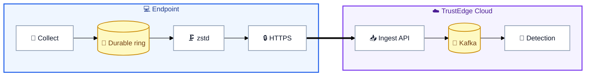

# TrustEdge Agent

**Cross-platform endpoint telemetry for modern detection.**

A focused Go agent that observes device posture on macOS, Linux, and Windows — then delivers reliable, compressed events to [TrustEdge](https://github.com/TrustEdgeOrg/TrustEdge) over HTTPS. No VPN required.

[](https://github.com/TrustEdgeOrg/TrustEdge-Agent/actions/workflows/agent-ci.yml)



---

## Why it exists

Security teams need **endpoint signal** without deploying heavyweight EDR stacks or routing traffic through a VPN. TrustEdge Agent is the thin collector at the edge of that pipeline:

| This agent | Hands off to |
|------------|--------------|
| Collect & upload telemetry | [TrustEdge-Agent-API](https://github.com/TrustEdgeOrg/TrustEdge-Agent-API) (auth, Kafka) |
| Survive offline / flaky networks | [TrustEdge](https://github.com/TrustEdgeOrg/TrustEdge) (rules, alerts, UI) |

Built for laptops and workstations first: lightweight, privacy-aware, and engineered to fail soft when the network disappears.

---

## What it collects

| Signal | Event types | Useful for |
|--------|-------------|------------|
| **Device** | `client_details` | Inventory, OS drift, agent health |
| **Network** | `network_summary` | Public IP / posture changes, connection load |
| **Activity** | `action_summary` | Foreground focus, idle vs active, app switches |
| **Processes** | `process_start` / `process_exit` | Lifecycle + cmdline (optional; can be disabled) |

<details>
<summary><strong>Privacy boundaries</strong> — what we deliberately do not collect</summary>

- Window titles or URLs  
- Keystrokes or clipboard  
- Screenshots  
- Raw Wi‑Fi SSIDs  
- Full remote IP connection tables  
- File contents  

Process command lines are truncated at 4 KiB. Turn process monitoring off with `TRUSTEDGE_AGENT_PROCESS_INTERVAL=0`.

</details>

---

## How it works

The diagram above is the full path. On the agent, that breaks down to:

1. **Collect** — concurrent OS collectors (details, network, activity, processes).  
2. **Queue** — events land in a **bounded, on-disk ring**; only removed after a successful upload.  
3. **Batch** — flush by size (default 32) or time (default 2s).  
4. **Compress** — optional zstd when it shrinks the payload.  
5. **Deliver** — `POST /v1/events` with device bearer auth; 401 triggers a single serialized re-register + retry.  
6. **Observe** — structured `slog` logs + periodic status metrics (`pending`, upload success/fail, auth recoveries).

Deep dive: [Architecture](docs/architecture.md) · [Collection & batching](docs/collection.md)

---

## Engineering highlights

Things that matter in a production endpoint agent — already in this codebase:

| Area | Design choice |
|------|----------------|
| **Reliability** | Durable event ring with overwrite-oldest policy + exponential backoff |
| **Shutdown** | Context-aware HTTP; short best-effort flush (events remain queued) |
| **Auth** | Device token in OS keyring; concurrent 401s share one re-register |
| **Efficiency** | Network summary built once per emit; zstd when beneficial |
| **Activity signal** | Fast foreground sampling (5s) inside slower summary windows (60s) |
| **Safety defaults** | Ingest URL required — no accidental cleartext default host |
| **Operability** | `text` / `json` logs + `agent status` metrics interval |
| **Platforms** | macOS · Linux · Windows; CI builds all three |

---

## Quick start

### Prerequisites

- Go **1.22+**
- An ingest API base URL (`TRUSTEDGE_AGENT_API_URL`)

### Local (recommended)

```bash
git clone https://github.com/TrustEdgeOrg/TrustEdge-Agent.git
cd TrustEdge-Agent

# Point at a local TrustEdge-Agent-API (or capture server)
export TRUSTEDGE_AGENT_API_URL=http://127.0.0.1:8080
# export TRUSTEDGE_AGENT_ENROLL_TOKEN=...   # if your API requires enroll

make build
./bin/trustedge-agent
```

Or one step: `make run-agent-local`.

On first run the agent registers, stores a device ID on disk, and keeps the device token in the **OS keyring**.

### Demo against a remote ingest host

```bash
export TRUSTEDGE_AGENT_API_URL=https://your-ingest.example
export TRUSTEDGE_AGENT_ENROLL_TOKEN=your-enroll-token
make run-agent   # or: make agent
```

Production checklist: `TRUSTEDGE_AGENT_PRODUCTION=1` enforces **HTTPS** + enroll token.  
Full knobs: [Configuration](docs/configuration.md).

---

## Platform support

| OS | Collection notes |
|----|------------------|
| **macOS** | Native foreground/idle; optional Endpoint Security watcher (CGO); poll fallback |
| **Linux** | procfs / netlink where available; poll reconciliation |
| **Windows** | ETW / Win32 probes; poll reconciliation |

Default CI builds use **CGO=0** (portable poll-mode). Optional `make build-cgo` enables richer watchers where the SDK allows.

---

## Project layout

```text
cmd/trustedge-agent/     Entrypoint — config, slog, signal lifecycle
internal/agent/          Runtime, durable ring, batcher, auth, metrics
internal/collect/        OS collectors + platform watchers
internal/api/            HTTPS client (register + events, context-aware)
internal/credentials/    Device ID + keyring-backed tokens
internal/codec/          Optional zstd
internal/config/         Env-based configuration + validation
docs/                    Architecture, collection, agent, configuration
```

---

## Develop

```bash
make test          # CGO_ENABLED=0 go test ./...
make build         # → bin/trustedge-agent
make build-all     # cross-compile darwin / linux / windows
make capture-events  # local fake ingest on :18080 for capturing payloads
```

| Doc | Purpose |
|-----|---------|
| [Architecture](docs/architecture.md) | Lifecycle, upload path, auth recovery |
| [Collection](docs/collection.md) | Collectors, flush rules, concurrency |
| [Agent guide](docs/agent.md) | Install paths, credentials, platforms |
| [Configuration](docs/configuration.md) | Every environment variable |
| [API reference](https://github.com/TrustEdgeOrg/TrustEdge-Agent-API/blob/main/docs/api.md) | HTTP schemas |

---

## Ecosystem

| Repository | Role |
|------------|------|
| **[TrustEdge-Agent](https://github.com/TrustEdgeOrg/TrustEdge-Agent)** | This agent |
| **[TrustEdge-Agent-API](https://github.com/TrustEdgeOrg/TrustEdge-Agent-API)** | Ingest · validate · Kafka |
| **[TrustEdge](https://github.com/TrustEdgeOrg/TrustEdge)** | Dashboard · rules · alerts |
| **[TrustEdgeClient](https://github.com/TrustEdgeOrg/TrustEdgeClient)** | Optional VPN enroll client |

---

Part of [TrustEdgeOrg](https://github.com/TrustEdgeOrg) · Built with Go.
