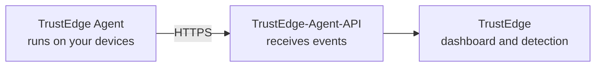
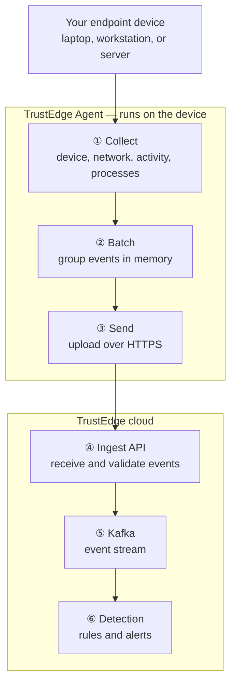
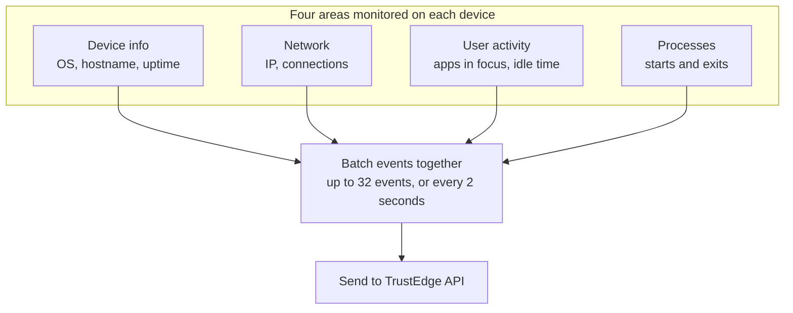

# TrustEdge Agent

A lightweight cross-platform endpoint agent for the [TrustEdge](https://github.com/TrustEdgeOrg/TrustEdge) security platform.

TrustEdge Agent runs on laptops, workstations, and servers. It collects device posture — OS info, network activity, user presence, and process lifecycle — and sends it securely to TrustEdge for detection and alerting. **No VPN required.**

**Platforms:** macOS · Linux · Windows

## How it fits in TrustEdge



| Repo | Role |
|------|------|
| **[TrustEdge Agent](https://github.com/TrustEdgeOrg/TrustEdge-Agent)** (this repo) | Collects endpoint telemetry and uploads it |
| **[TrustEdge-Agent-API](https://github.com/TrustEdgeOrg/TrustEdge-Agent-API)** | Ingest API — validates events, publishes to Kafka |
| **[TrustEdge](https://github.com/TrustEdgeOrg/TrustEdge)** | Dashboard, rules engine, alerts |
| **[TrustEdgeClient](https://github.com/TrustEdgeOrg/TrustEdgeClient)** | Optional VPN enroll client |

## How it works

Telemetry moves from the device to detection in six steps:



## What the agent watches



| Area | What is collected |
|------|-------------------|
| **Device** | Hostname, OS, architecture, agent version, uptime |
| **Network** | Public IP, connection counts, top remote ports |
| **User activity** | Foreground app focus, idle/active presence, app switches |
| **Processes** | Process starts and exits — pid, parent, user, name, executable path |

Details: [Collection and batching](docs/collection.md) · [Architecture](docs/architecture.md)

## Privacy

TrustEdge Agent is designed for **metadata only**. It does **not** collect:

- Window titles or URLs
- Keystrokes or clipboard contents
- Screenshots
- Raw Wi‑Fi SSIDs
- Full remote IP connection tables
- Command lines or file contents

Process monitoring can be disabled entirely: `TRUSTEDGE_AGENT_PROCESS_INTERVAL=0`

## Quick start

```bash
git clone https://github.com/TrustEdgeOrg/TrustEdge-Agent.git
cd TrustEdge-Agent

export TRUSTEDGE_AGENT_API_URL=https://your-api-host
export TRUSTEDGE_AGENT_ENROLL_TOKEN=your-enroll-token

make build
./bin/trustedge-agent
```

For local development without building:

```bash
TRUSTEDGE_AGENT_API_URL=http://127.0.0.1:8080 go run ./cmd/trustedge-agent
```

On first run the agent registers with the API and stores credentials locally (device ID on disk, token in the OS keyring). See [Agent guide](docs/agent.md) for platform paths and permissions.

## Documentation

| Guide | Description |
|-------|-------------|
| [docs/](docs/README.md) | Documentation index |
| [Architecture](docs/architecture.md) | End-to-end flow, compression, auth |
| [Collection and batching](docs/collection.md) | Collectors, flush triggers, upload |
| [Agent](docs/agent.md) | Installation, platforms, credentials |
| [Configuration](docs/configuration.md) | All environment variables |
| [API reference](https://github.com/TrustEdgeOrg/TrustEdge-Agent-API/blob/main/docs/api.md) | HTTP endpoints and payload schemas |

## For developers

### Build and test

```bash
make build       # → bin/trustedge-agent
make build-all   # cross-platform binaries
make test
```

### Local dev with TrustEdge stack

```bash
# Terminal 1 — ingest API
cd TrustEdge-Agent-API && go run ./cmd/trustedge-agent-api

# Terminal 2 — agent
cd TrustEdge-Agent && TRUSTEDGE_AGENT_API_URL=http://127.0.0.1:8080 go run ./cmd/trustedge-agent
```

### Project layout

```text
cmd/trustedge-agent/     # agent entrypoint
internal/collect/        # platform telemetry collectors
internal/agent/          # agent runtime + batcher
internal/api/            # HTTP client to ingest API
internal/codec/          # zstd compression
docs/                    # documentation
```

Part of [TrustEdgeOrg](https://github.com/TrustEdgeOrg).
