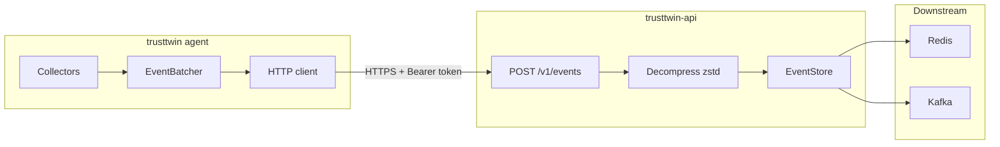
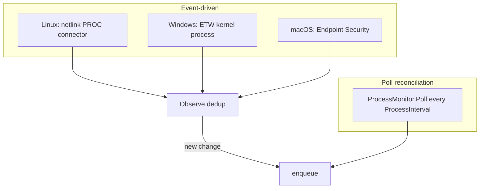
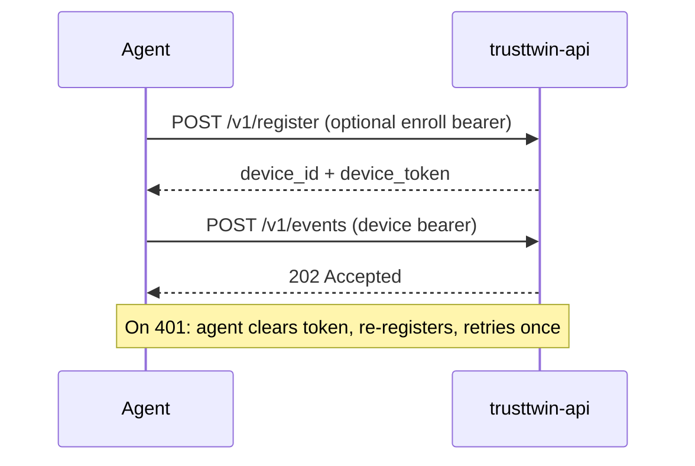

# Architecture

TrustTwin has two binaries:

| Binary | Role |
|--------|------|
| `trusttwin` | Endpoint agent — collects telemetry and POSTs to the API |
| `trusttwin-api` | Ingest API — authenticates agents, stores events, mirrors to Redis/Kafka |

Events flow to Redis and Kafka (`trusttwin.events`) for live observability and rules-based detection in TrustEdge.

## End-to-end flow



### Startup

1. `cmd/trusttwin` loads config and builds the collector, API client, and credentials store.
2. `EnsureRegistered()` loads saved device ID + token from disk/keyring, or calls `POST /v1/register`.
3. `Agent.Run()` starts collectors and the batch flush loop.

### Telemetry path

1. **Collect** — four concurrent sources produce typed payloads.
2. **Enqueue** — each source calls `batcher.Enqueue(type, payload)`.
3. **Buffer** — `EventBatcher` appends `models.Event` records (timestamp, device ID, type, payload).
4. **Flush** — when the buffer reaches `EventBatchSize` (default 32), `EventBatchFlush` elapses (default 2s), or the agent shuts down.
5. **Post** — `postEvents()` calls `client.PostEvents()`.
6. **Compress** — JSON is marshaled, then passed through `codec.MaybeCompress()`. If zstd shrinks the payload, the client sets `Content-Encoding: zstd`.
7. **Ingest** — the API decompresses if needed, decodes a batch or single event, validates, and calls `store.AddEvent()` per event.
8. **Response** — `202 Accepted` with `{ "status": "accepted", "accepted": N }`.

Failed batches are logged and dropped. There is no offline retry queue yet.

## Collectors

Four goroutines run concurrently inside `Agent.Run()`:

| Collector | Event type | Trigger |
|-----------|------------|---------|
| Client details | `client_details` | Once on startup, then every `DetailsInterval` (default 60s) |
| Network monitor | `network_summary` | On interface/IP change (debounced) + heartbeat every `NetworkInterval` |
| Action tracker | `action_summary` | Every `ActionInterval` (default 60s) |
| Process monitor | `process_start` / `process_exit` | Event-driven + poll every `ProcessInterval` (default 10s) |

### Process monitoring (hybrid)

Process visibility uses two layers:



- **Event-driven** delivers real-time exec/exit when a platform watcher is available.
- **Poll** reconciles state periodically and catches anything the watcher missed.
- `Observe()` deduplicates so the same PID transition is not sent twice.

Disable process monitoring entirely with `TRUSTTWIN_PROCESS_INTERVAL=0`.

## Batching

The `EventBatcher` (`internal/agent/batcher.go`) coalesces events before upload:

| Flush trigger | Default |
|---------------|---------|
| Buffer size | 32 events (`TRUSTTWIN_EVENT_BATCH_SIZE`) |
| Time interval | 2 seconds (`TRUSTTWIN_EVENT_BATCH_FLUSH`) |
| Shutdown | Final flush on context cancel |

A single-event flush sends a plain `Event` JSON object. Multi-event flushes send `{"events":[...]}`.

## Compression

The agent compresses telemetry with **zstd** (`internal/codec`):

- `MaybeCompress()` only sends compressed data when it is smaller than the original JSON.
- Compressed requests include `Content-Encoding: zstd`.
- The API decompresses on ingest; uncompressed JSON remains accepted for backward compatibility.
- Typical batches (32 events) compress well; tiny single-event payloads may stay uncompressed.

## Authentication



1. **Register** — `POST /v1/register` with optional enroll bearer token.
2. **Telemetry** — `POST /v1/events` with device bearer token.
3. **Recovery** — on `401 Unauthorized`, the agent clears the stored token, re-registers, and retries the batch once.

## API persistence

| Mode | Storage |
|------|---------|
| Dev (default) | In-memory + optional `data/devices.json` and `data/events.jsonl` |
| Production (`TRUSTTWIN_PRODUCTION=1`) | Redis required; disk persistence disabled |
| Kafka (optional) | Publishes to `KAFKA_TOPIC` (default `trusttwin.events`) after ingest |

## Project layout

```text
cmd/trusttwin/          Agent entrypoint
cmd/trusttwin-api/      API entrypoint
internal/agent/         Agent runtime, batcher, auth
internal/api/           HTTP client (register, post events)
internal/codec/         zstd compress/decompress
internal/collect/       Platform telemetry collectors
internal/config/        Env-based configuration
internal/credentials/   Device ID file + OS keyring token store
internal/server/        HTTP handlers
internal/store/         Memory, disk, Redis, Kafka backends
internal/models/        Event envelopes and payload types
```
