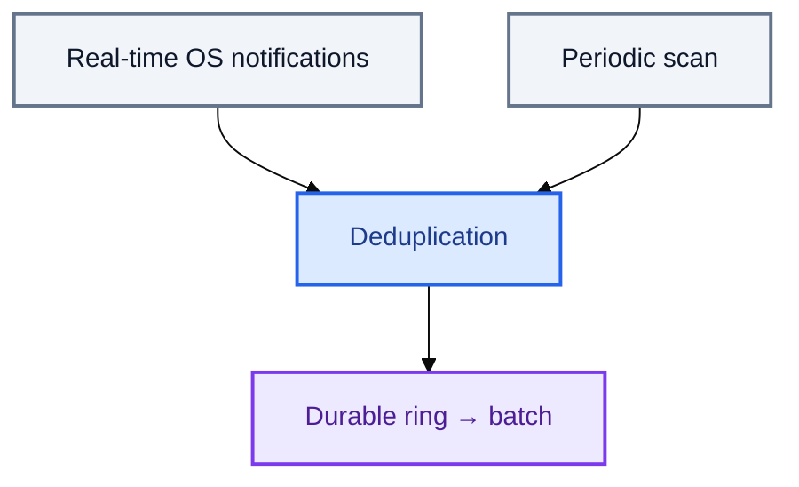
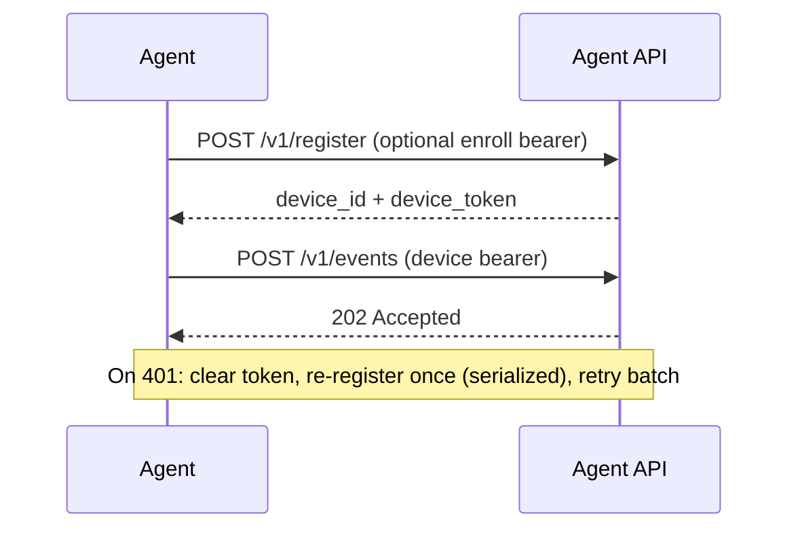

#  Architecture

The `trustedge-agent` binary collects endpoint telemetry and POSTs it to [TrustEdge-Agent-API](https://github.com/TrustEdgeOrg/TrustEdge-Agent-API). The API can publish to a stream for TrustEdge detection.

| | Component | Repo | Role |
|---|-----------|------|------|
|  | `trustedge-agent` | [TrustEdge-Agent](https://github.com/TrustEdgeOrg/TrustEdge-Agent) | Collect · batch · compress · secure upload |
|  | `trustedge-agent-api` | [TrustEdge-Agent-API](https://github.com/TrustEdgeOrg/TrustEdge-Agent-API) | Register · ingest · optional Kafka publish |
|  | TrustEdge | [TrustEdge](https://github.com/TrustEdgeOrg/TrustEdge) | Detection · alerts · UI |

<p align="center">
  
  &nbsp;<a href="#high-level-flow">Flow</a>
  &nbsp;·&nbsp;
  
  &nbsp;<a href="#agent-lifecycle">Lifecycle</a>
  &nbsp;·&nbsp;
  
  &nbsp;<a href="#collectors">Collectors</a>
  &nbsp;·&nbsp;
  
  &nbsp;<a href="#batching">Batching</a>
  &nbsp;·&nbsp;
  
  &nbsp;<a href="#compression">Compression</a>
  &nbsp;·&nbsp;
  
  &nbsp;<a href="#authentication">Auth</a>
</p>

> **Also see**
>  [Agent guide](agent.md)
> ·  [Collection & batching](collection.md)
> ·  [Configuration](configuration.md)

---

##  High-level flow



```mermaid
%%{init: {'theme': 'base', 'themeVariables': {'fontSize': '15px', 'fontFamily': 'arial'}}}%%
flowchart LR
    subgraph EP ["Endpoint"]
        DEV(["Device"])
    end

    subgraph AG ["TrustEdge Agent"]
        direction LR
        COL["Collect"] --> BAT["Batch"] --> ZIP["Compress"] --> SND["Secure upload"]
    end

    subgraph CL ["TrustEdge"]
        direction LR
        API["Agent API"] --> STR["Stream"] --> DET["Detection"] --> ALT["Alert"]
    end

    DEV --> COL
    SND -->|HTTPS + zstd| API

    classDef endpoint fill:#F8FAFC,stroke:#475569,stroke-width:2px,color:#0F172A
    classDef agent fill:#DBEAFE,stroke:#2563EB,stroke-width:2px,color:#1E3A8A
    classDef cloud fill:#EDE9FE,stroke:#7C3AED,stroke-width:2px,color:#4C1D95
    classDef stream fill:#FEF9C3,stroke:#CA8A04,stroke-width:2px,color:#713F12
    classDef compress fill:#FFEDD5,stroke:#EA580C,stroke-width:2px,color:#7C2D12

    class DEV endpoint
    class COL,BAT,SND agent
    class ZIP compress
    class API,DET,ALT cloud
    class STR stream
```

| Stage | Description |
|-------|-------------|
| **Collect** | Four concurrent sources: device, network, activity, processes |
| **Batch** | Events land in a **durable ring**; flushed by size, timer, or shutdown |
| **Compress** | Optional **zstd** when smaller than raw JSON |
| **Secure upload** | HTTPS `POST /v1/events` with the device bearer token |
| **Agent API** | Decompress · validate · accept (`202`) |
| **Stream** | Optional publish (e.g. Kafka `trustedge.agent.events`) |
| **Detection → Alert** | TrustEdge rules raise alerts |

Collector timers and flush edge cases: [Collection & batching](collection.md).

---

##  Agent lifecycle

### Startup

1. `cmd/trustedge-agent` loads config, builds the API client, credentials store, and metrics.  
2. `EnsureRegistered()` loads device ID + token from disk/keyring, or calls `POST /v1/register`.  
3. `Agent.Run()` starts collectors, the batch flush loop, and optional periodic status logs.

### Telemetry path

1. **Collect** — sources emit typed payloads.  
2. **Enqueue** — `batcher.Enqueue(type, payload)`.  
3. **Buffer** — `EventBatcher` appends `models.Event` records to the durable ring.  
4. **Flush** — pending ≥ `EventBatchSize` (default 32), `EventBatchFlush` elapses (default 2s), or shutdown.  
5. **Compress** — marshal JSON → `codec.MaybeCompress()`; set `Content-Encoding: zstd` when used.  
6. **Post** — `client.PostEvents()`; **Ack** from the ring only after success.  
7. **Ingest** — API decompresses if needed, validates, stores / publishes.  
8. **Response** — `202 Accepted` with `{ "status": "accepted", "accepted": N }`.

Failed uploads stay in the ring and retry with exponential backoff (capped by `TRUSTEDGE_AGENT_EVENT_RETRY_MAX`). When the ring is full, the **oldest** pending events are overwritten. Shutdown does a short best-effort flush (default **3s**); anything not uploaded remains on disk for the next start.

Structured logs: `TRUSTEDGE_AGENT_LOG_FORMAT=text|json`.  
Status metrics (interval `TRUSTEDGE_AGENT_METRICS_INTERVAL`): upload counters, pending depth, `auth_recover_total`.

---

##  Collectors

Five collectors run inside `Agent.Run()`:

| Collector | Event type | Trigger |
|-----------|------------|---------|
| Client details | `client_details` | Once at startup, then every `DetailsInterval` (default 60s) |
| Network monitor | `network_summary` | Interface/IP change (debounced) + `NetworkInterval` heartbeat |
| Action tracker | `action_summary` | Sample every `ActionSampleInterval` (5s); emit every `ActionInterval` (60s) |
| Process monitor | `process_start` / `process_exit` | OS watcher (when available) + poll every `ProcessInterval` (10s) |
| Security monitor | `driver_load` / `service_install` / `registry_persistence` | Watcher wake (kqueue / registry notify) + poll every `SecurityInterval` (30s) |

### Process monitoring (hybrid)



- **Real-time** — OS notifies on start/exit when the platform watcher is available.  
- **Periodic scan** — reconciles the process table and catches misses.  
- **Dedup** — same PID transition is not emitted twice.

Disable processes: `TRUSTEDGE_AGENT_PROCESS_INTERVAL=0`. Platform / CGO notes: [Agent guide](agent.md#platforms).

---

##  Batching

`EventBatcher` (`internal/agent/batcher.go`) writes through a durable ring (`internal/agent/ring.go`) before upload:

| Flush trigger | Default |
|---------------|---------|
| Pending size | 32 (`TRUSTEDGE_AGENT_EVENT_BATCH_SIZE`) |
| Time interval | 2s (`TRUSTEDGE_AGENT_EVENT_BATCH_FLUSH`) |
| Shutdown | Best-effort flush (3s bound) |

| Queue knob | Default |
|------------|---------|
| Capacity | 4096 (`TRUSTEDGE_AGENT_EVENT_QUEUE_CAPACITY`) |
| Path | `events.queue.json` beside the state file |
| Max backoff | 60s (`TRUSTEDGE_AGENT_EVENT_RETRY_MAX`) |

Wire shapes:

- One event → plain `Event` JSON  
- Several events → `{"events":[...]}`

---

##  Compression

`internal/codec` applies **zstd** only when it wins:

- Smaller than raw JSON → send compressed + `Content-Encoding: zstd`  
- Otherwise → send plain JSON  
- API accepts both (backward compatible)

---

##  Authentication



1. **Register** — `POST /v1/register` (optional enroll bearer).  
2. **Telemetry** — `POST /v1/events` with device bearer.  
3. **Recovery** — on `401`, clear token, re-register (mutex so concurrent 401s share one register), retry the batch once.

Device ID lives on disk; the token lives in the OS keyring. Details: [Agent guide](agent.md#credentials-and-state).

---

##  API persistence

Ingest storage and Kafka publishing are documented in [TrustEdge-Agent-API](https://github.com/TrustEdgeOrg/TrustEdge-Agent-API).

---

##  Project layout

```text
cmd/trustedge-agent/     Entrypoint — config, slog, signal lifecycle
internal/agent/          Runtime, durable ring, batcher, auth, metrics
internal/collect/        OS collectors + platform watchers
internal/api/            HTTPS client (register + events)
internal/credentials/    Device ID file + keyring tokens
internal/codec/          Optional zstd
internal/config/         Env-based configuration
internal/models/         Event envelopes and payloads
docs/                    Architecture, collection, agent, configuration
```
