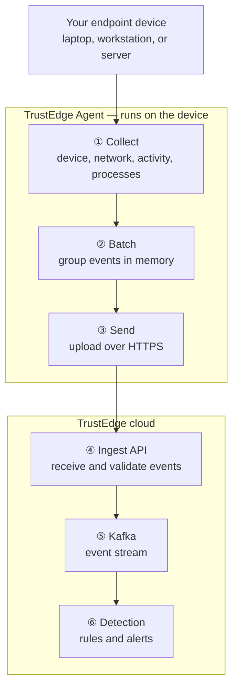
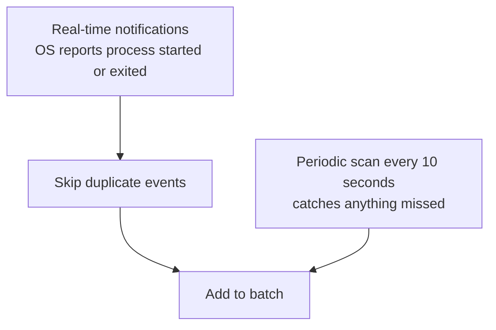
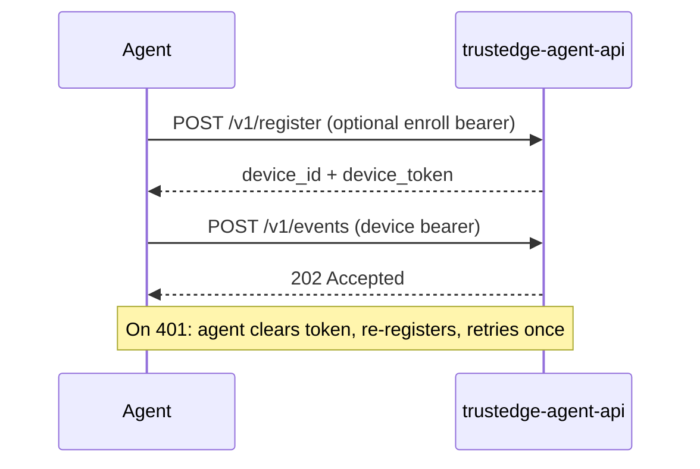

# Architecture

The `trustedge-agent` binary collects endpoint telemetry and POSTs it to [TrustEdge-Agent-API](https://github.com/TrustEdgeOrg/TrustEdge-Agent-API), which publishes to Kafka for the TrustEdge detection engine.

| Component | Repo | Role |
|-----------|------|------|
| `trustedge-agent` | TrustEdge-Agent | Endpoint agent — collectors, batching, HTTPS upload |
| `trustedge-agent-api` | TrustEdge-Agent-API | Ingest API — auth, Kafka |

Events flow to Kafka (`trustedge.agent.events`) for rules-based detection in TrustEdge.

## High-level flow

How telemetry moves from an endpoint to TrustEdge detection — in six steps.



| Step | What happens |
|------|----------------|
| **① Collect** | Four collectors gather device, network, user activity, and process telemetry from the OS. |
| **② Batch** | Events are held in memory and grouped together (up to 32 events or every 2 seconds). |
| **③ Send** | The agent uploads the batch to the ingest API over HTTPS. |
| **④ Ingest** | The API validates each event and accepts the batch. |
| **⑤ Kafka** | Events are published to the event stream. |
| **⑥ Detection** | TrustEdge applies rules and raises alerts. |

For collector details, dedup rules, and batch timing, see [Collection and batching](collection.md).

## Agent lifecycle

### Startup

1. `cmd/trustedge-agent` loads config and builds the collector, API client, and credentials store.
2. `EnsureRegistered()` loads saved device ID + token from disk/keyring, or calls `POST /v1/register`.
3. `Agent.Run()` starts collectors and the batch flush loop.

### Telemetry path

1. **Collect** — four concurrent sources produce typed payloads.
2. **Enqueue** — each source calls `batcher.Enqueue(type, payload)`.
3. **Buffer** — `EventBatcher` appends `models.Event` records (timestamp, device ID, type, payload).
4. **Flush** — when the buffer reaches `EventBatchSize` (default 32), `EventBatchFlush` elapses (default 2s), or the agent shuts down.
5. **Post** — `postEvents()` calls `client.PostEvents()`.
6. **Compress** — JSON is marshaled, then passed through `codec.MaybeCompress()`. If zstd shrinks the payload, the client sets `Content-Encoding: zstd`.
7. **Ingest** — the API decompresses if needed, decodes a batch or single event, validates, and calls `store.AddEvent()` per event.
8. **Response** — `202 Accepted` with `{ "status": "accepted", "accepted": N }`.

Failed batches are logged and dropped. There is no offline retry queue yet.

## Collectors

Four goroutines run concurrently inside `Agent.Run()`:

| Collector | Event type | Trigger |
|-----------|------------|---------|
| Client details | `client_details` | Once on startup, then every `DetailsInterval` (default 60s) |
| Network monitor | `network_summary` | On interface/IP change (debounced) + heartbeat every `NetworkInterval` |
| Action tracker | `action_summary` | Every `ActionInterval` (default 60s) |
| Process monitor | `process_start` / `process_exit` | Event-driven + poll every `ProcessInterval` (default 10s) |

### Process monitoring (hybrid)

Process visibility uses two layers:



- **Real-time** — the OS notifies the agent immediately when a process starts or exits (when supported on the platform).
- **Periodic scan** — every 10 seconds the agent compares the full process list and catches anything missed.
- **Dedup** — the same process event is never sent twice.

Disable process monitoring entirely with `TRUSTEDGE_AGENT_PROCESS_INTERVAL=0`.

## Batching

The `EventBatcher` (`internal/agent/batcher.go`) coalesces events before upload:

| Flush trigger | Default |
|---------------|---------|
| Buffer size | 32 events (`TRUSTEDGE_AGENT_EVENT_BATCH_SIZE`) |
| Time interval | 2 seconds (`TRUSTEDGE_AGENT_EVENT_BATCH_FLUSH`) |
| Shutdown | Final flush on context cancel |

A single-event flush sends a plain `Event` JSON object. Multi-event flushes send `{"events":[...]}`.

## Compression

The agent compresses telemetry with **zstd** (`internal/codec`):

- `MaybeCompress()` only sends compressed data when it is smaller than the original JSON.
- Compressed requests include `Content-Encoding: zstd`.
- The API decompresses on ingest; uncompressed JSON remains accepted for backward compatibility.
- Typical batches (32 events) compress well; tiny single-event payloads may stay uncompressed.

## Authentication



1. **Register** — `POST /v1/register` with optional enroll bearer token.
2. **Telemetry** — `POST /v1/events` with device bearer token.
3. **Recovery** — on `401 Unauthorized`, the agent clears the stored token, re-registers, and retries the batch once.

## API persistence

Ingest persistence is documented in [TrustEdge-Agent-API](https://github.com/TrustEdgeOrg/TrustEdge-Agent-API).

## Project layout

```text
cmd/trustedge-agent/          Agent entrypoint
internal/agent/         Agent runtime, batcher, auth
internal/api/           HTTP client (register, post events)
internal/codec/         zstd compress/decompress
internal/collect/       Platform telemetry collectors
internal/config/        Env-based configuration
internal/credentials/   Device ID file + OS keyring token store
internal/models/        Event envelopes and payload types
```
