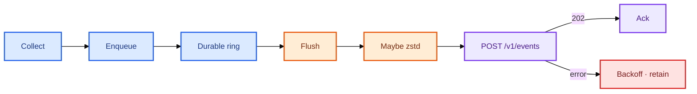
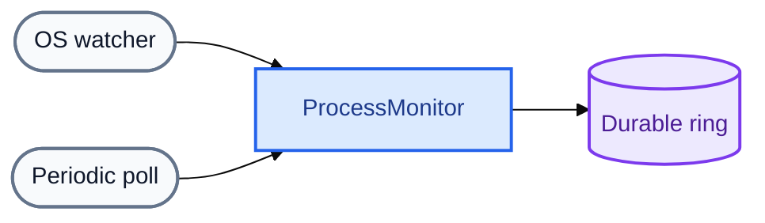
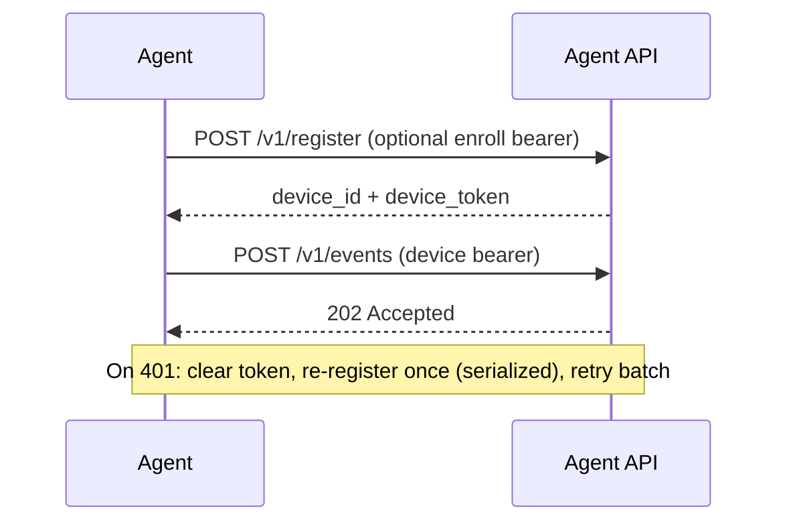

#  Architecture

`trustedge-agent` collects endpoint telemetry on the device, buffers it durably, and uploads over HTTPS to [TrustEdge-Agent-API](https://github.com/TrustEdgeOrg/TrustEdge-Agent-API). The API may publish events into a stream consumed by TrustEdge for detection and alerting.

<p align="center">
  
</p>

<p align="center">
  <a href="#system-context">Context</a>
  &nbsp;·&nbsp;
  <a href="#data-path">Data path</a>
  &nbsp;·&nbsp;
  <a href="#agent-lifecycle">Lifecycle</a>
  &nbsp;·&nbsp;
  <a href="#collectors">Collectors</a>
  &nbsp;·&nbsp;
  <a href="#batching-and-reliability">Batching</a>
  &nbsp;·&nbsp;
  <a href="#authentication">Authentication</a>
  &nbsp;·&nbsp;
  <a href="#repository-layout">Layout</a>
</p>

---

## System context

| Component | Repository | Responsibility |
|-----------|------------|----------------|
|  `trustedge-agent` | [TrustEdge-Agent](https://github.com/TrustEdgeOrg/TrustEdge-Agent) | Collect, batch, compress, upload |
|  `trustedge-agent-api` | [TrustEdge-Agent-API](https://github.com/TrustEdgeOrg/TrustEdge-Agent-API) | Register devices, ingest events, optional Kafka publish |
|  TrustEdge | [TrustEdge](https://github.com/TrustEdgeOrg/TrustEdge) | Detection rules, alerts, dashboard |

Related: [Collection](collection.md) · [Agent guide](agent.md) · [Configuration](configuration.md)

---

## Data path


| Stage | Behavior |
|-------|----------|
| **Collect** | Concurrent collectors: host, network summary, connection samples, activity, processes, security, AI inventory |
| **Batch** | Events append to a durable ring; flush by size, timer, or shutdown |
| **Compress** | Apply zstd when the payload is smaller than raw JSON |
| **Secure upload** | `POST /v1/events` over HTTPS with the device bearer token |
| **Agent API** | Decompress if needed, validate, accept with `202` |
| **Stream** | Optional publish (for example Kafka `trustedge.agent.events`) |
| **Detection → Alert** | TrustEdge evaluates rules, behavior, and AI activity → alerts |

Collector timing and flush edge cases: [Collection & batching](collection.md).

---

## Agent lifecycle

### Startup

1. Load configuration; construct the API client, credentials store, and metrics.  
2. `EnsureRegistered()` restores `device_id` and token from disk/keyring, or calls `POST /v1/register`.  
3. `Agent.Run()` starts collectors, the batch flush loop, and optional status logging.

### Runtime path



| Step | Detail |
|------|--------|
| Collect | Typed payloads from each collector |
| Enqueue | `batcher.Enqueue(type, payload)` |
| Buffer | Persist `models.Event` records in the durable ring |
| Flush | Pending ≥ 32, every 2s, or shutdown (~3s best-effort) |
| Compress | `codec.MaybeCompress()` after JSON marshal |
| Post | `client.PostEvents()`; ring **Ack** only after success |
| Failure | Retain queued events; exponential backoff up to `TRUSTEDGE_AGENT_EVENT_RETRY_MAX` |

When the ring is full, the oldest pending events are overwritten. Events not flushed at shutdown remain on disk for the next start.

| Operability | Configuration |
|-------------|----------------|
| Log format | `TRUSTEDGE_AGENT_LOG_FORMAT=text\|json` |
| Status metrics | `TRUSTEDGE_AGENT_METRICS_INTERVAL` (upload counters, pending depth, `auth_recover_total`) |

---

## Collectors

| Collector | Event type(s) | Trigger |
|-----------|---------------|---------|
| Host | `client_details` | Startup, then every `DetailsInterval` (60s) |
| Network | `network_summary` | Link/IP change (debounced) + heartbeat |
| Connections | `network_connection` | Poll (`ConnectionInterval`, 15s); new ESTABLISHED TCP only |
| Activity | `action_summary` | Sample every 5s; emit every 60s |
| Processes | `process_start` / `process_exit` | OS watcher + poll (10s) |
| Security | `driver_load` / `service_install` / `registry_persistence` | Watcher wake + poll (30s) |
| AI inventory | `known_ai_app` | Poll (`KnownAIInterval`, 60s) + wake from process RuntimeFeed |

Disable: processes `PROCESS_INTERVAL=0` · security `SECURITY_INTERVAL=0` · AI inventory `KNOWN_AI_INTERVAL=0` · connections `CONNECTION_INTERVAL=0` (all `TRUSTEDGE_AGENT_*`).

### Hybrid process monitoring



| Path | Role |
|------|------|
| Watcher | Low-latency start/exit when the platform API is available |
| Poll | Reconcile the process table; catch misses; operate alone if the watcher is unavailable |
| Dedup | Suppress duplicate PID transitions |

Disable process monitoring with `TRUSTEDGE_AGENT_PROCESS_INTERVAL=0`.  
Per-OS mechanisms: [Collection](collection.md#how-detection-works-per-os). Platform privileges: [Agent guide](agent.md#platforms).

---

## Batching and reliability

`EventBatcher` (`internal/agent/batcher.go`) persists through `EventRing` (`internal/agent/ring.go`) before upload.

| Flush trigger | Default | Variable |
|---------------|---------|----------|
| Pending size | 32 | `TRUSTEDGE_AGENT_EVENT_BATCH_SIZE` |
| Time interval | 2s | `TRUSTEDGE_AGENT_EVENT_BATCH_FLUSH` |
| Shutdown | ~3s best-effort | — |

| Queue setting | Default |
|---------------|---------|
| Capacity | 4096 (`TRUSTEDGE_AGENT_EVENT_QUEUE_CAPACITY`) |
| Path | `events.queue.json` beside the state file |
| Max retry backoff | 60s (`TRUSTEDGE_AGENT_EVENT_RETRY_MAX`) |

Wire format: a single event is a plain `Event` object; two or more events use `{"events":[...]}`.

### Compression

`internal/codec` applies zstd only when beneficial:

| Result | Behavior |
|--------|----------|
| Smaller than raw JSON | Compressed body + `Content-Encoding: zstd` |
| Otherwise | Plain JSON |
| API | Accepts both encodings |

---

## Authentication



| Step | Behavior |
|------|----------|
| Register | `POST /v1/register` (optional enroll bearer) |
| Telemetry | `POST /v1/events` with device bearer |
| Recovery | On `401`, clear token, re-register under a mutex, retry the batch once |

Device ID is stored on disk; the device token is stored in the OS keyring. See [Agent guide — credentials](agent.md#credentials-and-state).

---

## API persistence

Ingest storage and stream publishing are owned by [TrustEdge-Agent-API](https://github.com/TrustEdgeOrg/TrustEdge-Agent-API).

---

## Repository layout

```text
cmd/trustedge-agent/     Entrypoint — config, slog, signal lifecycle
internal/agent/          Runtime, durable ring, batcher, auth, metrics
internal/collect/        OS collectors and platform watchers
internal/identity/       AI tools catalog matching / confidence
internal/api/            HTTPS client (register + events)
internal/credentials/    Device ID file and keyring tokens
internal/codec/          Optional zstd
internal/config/         Environment-based configuration
internal/models/         Event envelopes and payloads
internal/constants/      Event type names and shared defaults
docs/                    Architecture, collection, agent, configuration
```

---

## Design principles

1. **Thin edge** — the agent collects and delivers; detection runs in TrustEdge.  
2. **Durable by default** — acknowledge from the ring only after a successful upload.  
3. **Safe auth recovery** — concurrent `401` responses share one re-registration.  
4. **Hybrid collection** — watchers for latency, polls for correctness ([details](collection.md#how-detection-works-per-os)).
