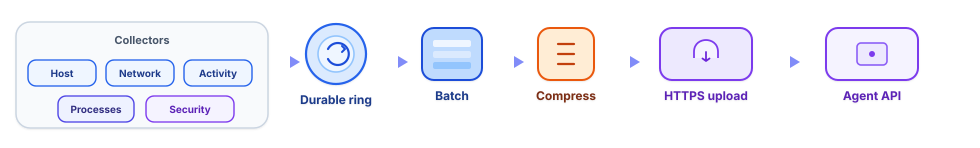
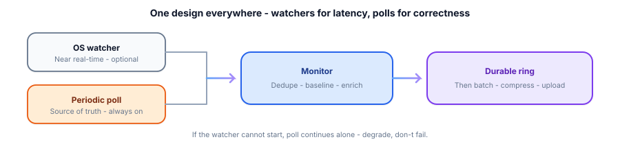
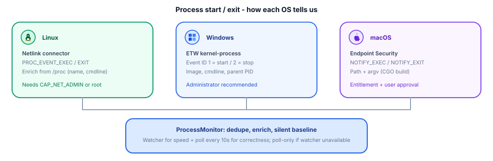
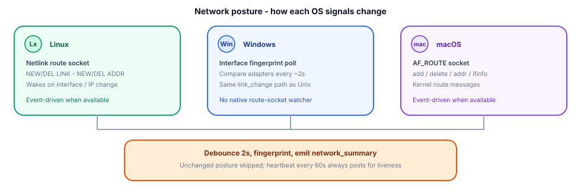
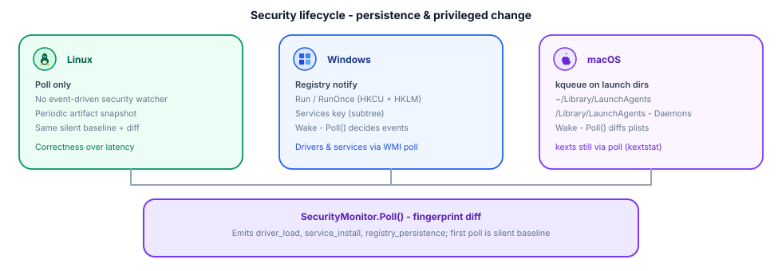
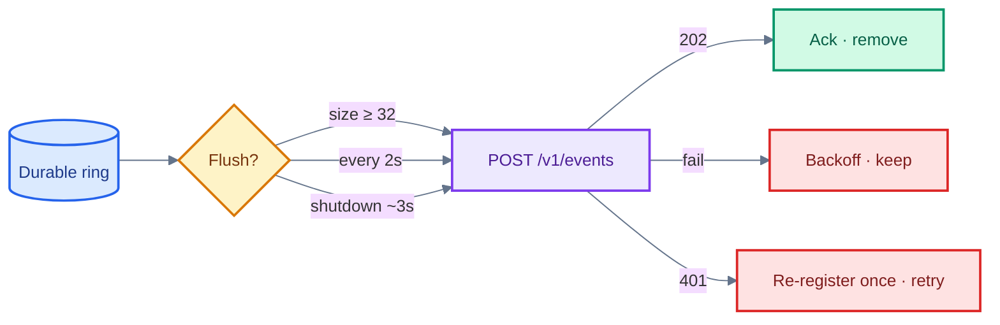

#  Collection and batching

How the agent notices change on a laptop, turns it into events, and delivers them reliably.

> **In one breath:** Collectors only **enqueue**. A durable ring owns retry. Watchers make it fast; polls make it correct.

  <a href="#big-picture">Big picture</a>
  &nbsp;·&nbsp;
  <a href="#hybrid-design">Hybrid design</a>
  &nbsp;·&nbsp;
  <a href="#what-we-collect">What we collect</a>
  &nbsp;·&nbsp;
  <a href="#how-detection-works-per-os">Per OS</a>
  &nbsp;·&nbsp;
  <a href="#batch--upload">Batch &amp; upload</a>

---

## Big picture

  

| Rule | Meaning |
|------|---------|
| Collectors never call the network | Isolation — one upload path |
| Mixed event types share a batch | Quiet and busy hosts both work |
| Failed uploads stay in the ring | Survive offline / flaky Wi‑Fi |
| Watcher dies → poll continues | Degrade, don’t fail |

---

## Hybrid design

  

Same pattern for **process**, **network summary**, and **security**:

1. **Watcher** (when the OS allows) → low-latency wake or typed event  
2. **Poll** → silent baseline, catch misses, work alone if needed  
3. **Monitor** → dedupe / fingerprint / enrich  
4. **Ring** → batch → optional zstd → HTTPS  

**Connection samples** (`network_connection`) are poll-only: silent baseline, then newly seen ESTABLISHED TCP sockets (capped per poll).

Deep OS detail is in the diagrams below.

---

## What we collect

|  Signal | Events | Default cadence |
|---|--------|-----------------|
| Host | `client_details` | Once at start + every 60s |
| Network | `network_summary` | On change (debounced) + 60s heartbeat |
| Connections | `network_connection` | 15s poll · new ESTABLISHED TCP (pid, ports, remote) |
| Activity | `action_summary` | Sample 5s · emit 60s |
| Processes | `process_start` / `process_exit` | Watcher + 10s poll |
| Security | `driver_load` / `service_install` / `registry_persistence` | Watcher wake + 30s poll |
| AI inventory | `known_ai_app` | 60s poll + wake from process events |

Turn off: processes `PROCESS_INTERVAL=0` · security `SECURITY_INTERVAL=0` · AI inventory `KNOWN_AI_INTERVAL=0` · connections `CONNECTION_INTERVAL=0` (all `TRUSTEDGE_AGENT_*`).

AI inventory covers verified catalog products across:

| Category | Examples |
|----------|----------|
| GUI apps | Cursor, Claude |
| CLI agents | Claude Code, Codex, Gemini CLI, Copilot CLI |
| Local model runtimes | Ollama (app or Docker), llama.cpp-family |
| IDE extensions | GitHub Copilot, Continue, Cline, Roo (Cursor / VS Code hosts) |

Identity uses catalog matching with evidence (path, bundle ID, signing, package, extension ID, Docker image). Collectors stay local — only the upload path sends data over the network.

---

## How detection works per OS

###  Processes

  

| OS | How we hear about start / exit |
|----|--------------------------------|
| **Linux** | Netlink process connector → enrich from `/proc` |
| **Windows** | ETW Microsoft-Windows-Kernel-Process (admin recommended) |
| **macOS** | Endpoint Security `EXEC` / `EXIT` (CGO + entitlement) |

**Always:** a timed poll reconciles the process table (first poll is silent). Cap: 100 starts per poll.

###  Network

  

| OS | How we notice link / IP change |
|----|--------------------------------|
| **Linux** | Netlink route (`NEW/DEL LINK` · `ADDR`) |
| **Windows** | Interface fingerprint every ~2s (same `link_change` path) |
| **macOS** | AF_ROUTE socket (add / delete / addr / ifinfo) |

Then: **debounce 2s** → summary fingerprint → emit. Heartbeats **always** post so liveness is visible even when posture is unchanged.

###  Connection samples

Poll-only (`TRUSTEDGE_AGENT_CONNECTION_INTERVAL`, default **15s**):

| Behavior | Detail |
|----------|--------|
| Scope | Newly observed **ESTABLISHED** TCP sockets with pid + remote |
| Baseline | First poll is silent (seeds seen set) |
| Cap | At most **40** new sockets per poll |
| Payload | `pid`, `comm`, local/remote addr+port, optional reverse-DNS hostname |
| Disable | `TRUSTEDGE_AGENT_CONNECTION_INTERVAL=0` |

This is **not** a full connection-table dump — only incremental samples after the baseline.

###  Security lifecycle

  

| OS | Event-driven wake | What Poll() reports |
|----|-------------------|---------------------|
| **Linux** | — (poll only) | Platform artifacts on interval |
| **Windows** | Registry notify on Run/RunOnce + Services | Drivers, services, Run keys |
| **macOS** | `kqueue` on LaunchAgents / LaunchDaemons dirs | kexts, LaunchDaemons, LaunchAgents |

The watcher **never invents** event types — it only wakes `Poll()`. First poll seeds a silent baseline.

---

## Batch & upload

| Topic | Behavior |
|-------|----------|
| **Compress** | zstd only when smaller than raw JSON |
| **Auth** | Device token in OS keyring; concurrent `401`s share one re-register |
| **Capacity** | Ring holds 4096; overwrite oldest when full |
| **Privacy** | No titles, keystrokes, screenshots, or SSIDs; connection samples are incremental/capped |

Concurrency: each collector runs in its own loop — a slow public-IP lookup never blocks process events.

---

## Dig deeper

| | Doc |
|---|-----|
|  | [Architecture](architecture.md) — lifecycle & auth sequence |
|  | [Configuration](configuration.md) — every env var |
|  | [Agent guide](agent.md) — install, credentials, privacy |
|  | [API reference](https://github.com/TrustEdgeOrg/TrustEdge-Agent-API/blob/main/docs/api.md) — payload fields |
