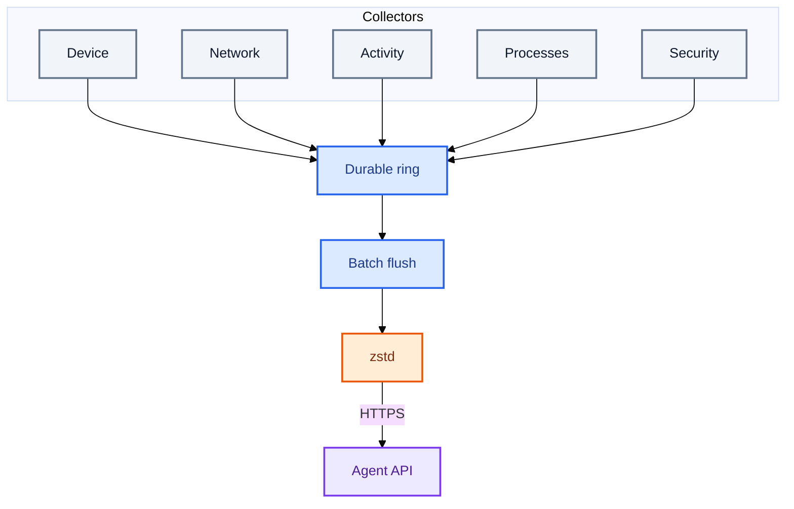
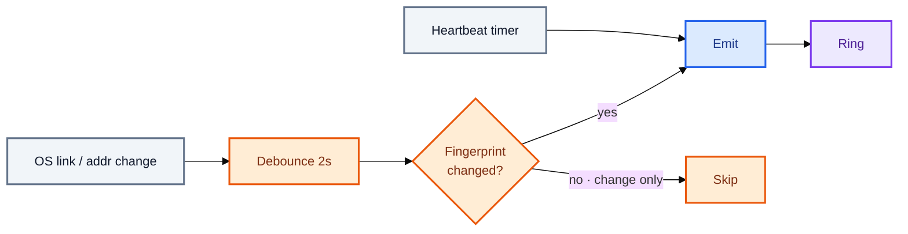
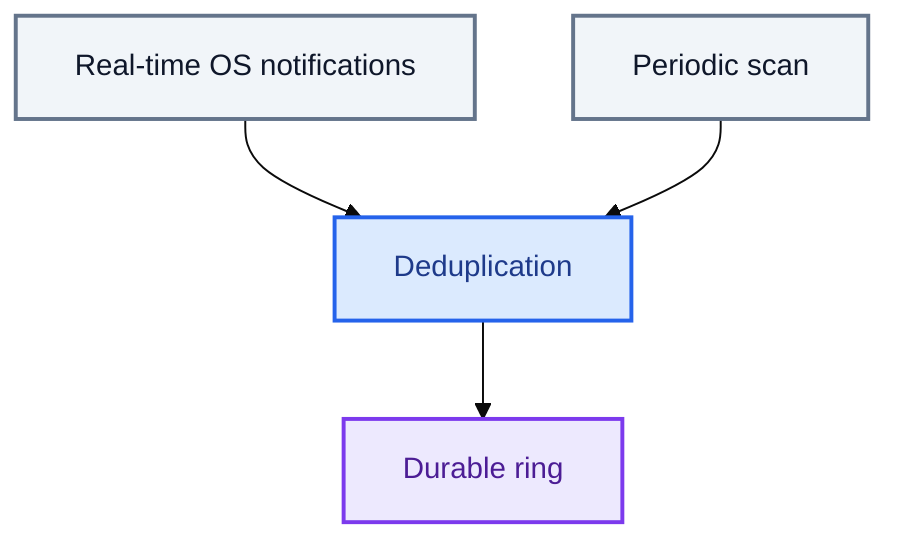
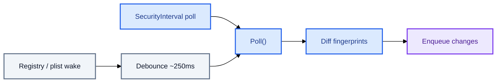

#  Collection and batching

How `trustedge-agent` collects telemetry, buffers it in a durable ring, and uploads to [TrustEdge-Agent-API](https://github.com/TrustEdgeOrg/TrustEdge-Agent-API).

> **In one breath:** Five collectors enqueue into one durable ring. Collectors never call the network — the batcher owns flush, compress, retry, and auth recovery.

<p align="center">
  
  &nbsp;<a href="#mental-model">Model</a>
  &nbsp;·&nbsp;
  
  &nbsp;<a href="#collectors">Collectors</a>
  &nbsp;·&nbsp;
  
  &nbsp;<a href="#batching">Batching</a>
  &nbsp;·&nbsp;
  
  &nbsp;<a href="#upload">Upload</a>
  &nbsp;·&nbsp;
  
  &nbsp;<a href="#concurrency-model">Concurrency</a>
  &nbsp;·&nbsp;
  
  &nbsp;<a href="#related-docs">Related</a>
</p>

> **Also see**
>  [Platform watchers](watchers-overview.md)
> ·  [Architecture](architecture.md)
> ·  [Configuration](configuration.md)
> ·  [Docs hub](README.md)

---

##  Mental model



| Rule | Why it matters |
|------|----------------|
| Collectors only **enqueue** | Isolation — no collector talks to the network |
| Mixed types share one batch | Efficient uploads under quiet and busy load |
| Failed uploads stay in the ring | Offline / flaky networks do not drop history (until capacity) |
| `401` → one re-register + retry | Serialized recovery under concurrent flush |

---

##  Runtime startup

`Agent.Run()` (`internal/agent/agent.go`):

1. Open `EventBatcher` (restore pending events from disk) and start `batcher.Run(ctx)`.  
2. Bind `enqueue(typ, payload)` → `batcher.Enqueue`.  
3. Emit one `client_details` immediately.  
4. Start the five collector loops.  
5. Block until cancel (SIGINT / SIGTERM).  
6. Best-effort final flush (**3s**); leftovers remain in the durable ring.

`EnsureRegistered()` runs **before** `Run()` and is independent of collection.

---

##  Event envelope

Every enqueue becomes a `models.Event`:

| Field | Source |
|-------|--------|
| `event_id` | Timestamp ID (`evt_YYYYMMDDTHHMMSS.nnnnnnnnn`) |
| `device_id` | Credentials store (set at registration) |
| `type` | Event type constant |
| `ts` | UTC at enqueue |
| `payload` | Collector-specific map |

Payload schemas: [API reference](https://github.com/TrustEdgeOrg/TrustEdge-Agent-API/blob/main/docs/api.md).

---

##  Collectors

| Collector | Event type(s) | Default timing | Config |
|-----------|---------------|----------------|--------|
| Client details | `client_details` | 60s (+ once at start) | `DETAILS_INTERVAL` |
| Network monitor | `network_summary` | 60s heartbeat + on change | `NETWORK_INTERVAL`, `NETWORK_DEBOUNCE` |
| Action tracker | `action_summary` | Sample 5s / emit 60s | `ACTION_SAMPLE_INTERVAL`, `ACTION_INTERVAL` |
| Process monitor | `process_start`, `process_exit` | 10s poll + watcher | `PROCESS_INTERVAL` (`0` = off) |
| Security monitor | `driver_load`, `service_install`, `registry_persistence` | watcher wake + 30s poll | `SECURITY_INTERVAL` (`0` = off) |

*(Abbreviated names; full names use the `TRUSTEDGE_AGENT_` prefix.)*

### Client details

| | |
|-|-|
| **Purpose** | Device identity and online heartbeat |
| **Trigger** | Once when `Run()` starts, then every `DetailsInterval` |
| **Payload** | hostname, OS, OS version, arch, agent version, timezone, status (`online`), uptime |
| **Code** | `Collector.ClientDetailsPayload()` in `internal/collect/collector.go` |

### Network summary

**Purpose:** Coarse posture — public IP, interface type, socket counts, top remote ports.



| Reason | When |
|--------|------|
| `initial` | Once when the monitor starts |
| `link_change` | OS link change, after debounce |
| `heartbeat` | Every `NetworkInterval` (**always** emitted) |

**Collection** (`NetworkSummaryPayload`): public IP (or `off`) · interface type · listen/established counts · top 5 remote ports.  
**Code:** `NetworkMonitor` + `network_watch_*.go`. Platform matrix: [Platform watchers](watchers-overview.md).

### Action summary

**Purpose:** Short-window activity — focus, idle/active presence, app switches.

| Loop | Interval | Action |
|------|----------|--------|
| Sample | 5s | `tracker.Sample()` — foreground via platform probe |
| Emit | 60s | `SnapshotAndReset()` → one `action_summary` |

Focus accumulates per app (bundle ID, else name). Presence is `active` if idle &lt; 60s at snapshot.  
**Payload:** `window_start`, `window_end`, `focus[]`, `presence`, `idle_sec`, `app_switches`.  
**Code:** `ActionTracker` in `internal/collect/actions.go`.

### Process monitor

**Purpose:** Process lifecycle with metadata and command line (truncated at 4 KiB).



| Path | Behavior |
|------|----------|
| **Event-driven** | `ProcessWatcher` → `Observe()` — skip duplicate starts; enrich exits from `seen` |
| **Poll** | Diff process table; **first poll silent**; later polls emit start/exit; cap **100 starts / poll** |
| **Fallback** | Unavailable watcher → poll-only |

Disable: `TRUSTEDGE_AGENT_PROCESS_INTERVAL=0`.  
**Code:** `process_monitor.go` + `process_watch_*.go`. Matrix: [Platform watchers](watchers-overview.md).

### Security monitor

**Purpose:** Persistence / privileged lifecycle changes.



| Platform | Event-driven wake |
|----------|-------------------|
| **macOS** | `kqueue` on LaunchAgents / LaunchDaemons dirs |
| **Windows** | `RegNotifyChangeKeyValue` on Run/RunOnce + Services |
| **Linux / other** | Poll-only |

| Event | Windows | macOS |
|-------|---------|-------|
| `driver_load` | Running `Win32_SystemDriver` | Loaded kexts (`kextstat -l`) |
| `service_install` | Non-driver `Win32_Service` | New `/Library/LaunchDaemons/*.plist` |
| `registry_persistence` | Run / RunOnce values | LaunchAgents under `~/Library` and `/Library` |

First poll seeds silently. Disable: `TRUSTEDGE_AGENT_SECURITY_INTERVAL=0`.  
**Code:** `security_monitor.go` + `security_watch_*.go` + `security_windows.go` / `security_darwin.go`.

---

##  Batching

`EventBatcher` + `EventRing`: append on enqueue; remove only after a successful upload.

### Flush triggers

| Trigger | Default | Config |
|---------|---------|--------|
| Size | 32 events | `TRUSTEDGE_AGENT_EVENT_BATCH_SIZE` |
| Timer | 2s | `TRUSTEDGE_AGENT_EVENT_BATCH_FLUSH` |
| Shutdown | Context cancelled | ~3s best-effort |

### Flush steps

1. `Peek` up to batch size (do not remove yet).  
2. `postEvents(ctx, batch)` — request context so cancel can abort in-flight uploads.  
3. Success → `Ack`. Failure → leave queued; increase backoff up to `EVENT_RETRY_MAX`.  
4. Structured logs + periodic `agent status` metrics.

### Offline ring

| Setting | Default | Behavior |
|---------|---------|----------|
| `EVENT_QUEUE_CAPACITY` | `4096` | Bounded FIFO; overwrite oldest when full |
| `EVENT_QUEUE_PATH` | `<state-dir>/events.queue.json` | Atomic JSON across restarts |

Size-triggered `signalFlush()` uses a buffered channel of size 1 — multiple signals coalesce.

### Timing example

```text
t=0s     client_details + network initial enqueued
t=2s     timer flush → POST pending
t=10s    process poll may add starts/exits
t=12s    timer flush → POST accumulated
…
t=60s    client_details + action_summary + network heartbeat may share a batch
```

Busy hosts hit the **size** trigger; quiet hosts lean on the **2s** timer.

---

##  Upload

| Batch size | JSON shape |
|------------|------------|
| 1 | Plain `Event` |
| 2+ | `{"events":[...]}` |

**Compression:** `codec.MaybeCompress()` — zstd only when smaller; then `Content-Encoding: zstd`.

```http
POST /v1/events
Content-Type: application/json
Content-Encoding: zstd          # if compressed
Authorization: Bearer <device_token>
```

Response: `202 Accepted` · `{ "status": "accepted", "accepted": N }`.

### Auth recovery

On `401` (`internal/agent/auth.go`):

1. Mutex so concurrent 401s share one recovery.  
2. Clear device token.  
3. `POST /v1/register` unless another caller already refreshed.  
4. Retry the **same batch** once.

Other errors: leave queued; exponential backoff on the flush loop.

---

##  Concurrency model

```text
main goroutine
├── batcher.Run()                 — flush loop (timer + wake + shutdown)
├── loop(DetailsInterval)         — client_details
├── NetworkMonitor.Run()          — network_summary
├── loop(ActionSampleInterval)    — Sample() foreground
├── loop(ActionInterval)          — action_summary snapshot
├── ProcessWatcher.Run()          — event-driven processes (if available)
├── loop(ProcessInterval)         — process poll reconcile
├── SecurityWatcher.Run()         — event-driven security wakes (if available)
└── loop(SecurityInterval)        — security lifecycle poll reconcile
```

Collectors are independent — a slow public-IP lookup does not block process enqueues.

---

##  Configuration quick reference

| Variable | Default | Affects |
|----------|---------|---------|
| `TRUSTEDGE_AGENT_DETAILS_INTERVAL` | `60` | Client details heartbeat |
| `TRUSTEDGE_AGENT_NETWORK_INTERVAL` | `60` | Network heartbeat |
| `TRUSTEDGE_AGENT_NETWORK_DEBOUNCE` | `2` | Change debounce |
| `TRUSTEDGE_AGENT_ACTION_INTERVAL` | `60` | Action summary window |
| `TRUSTEDGE_AGENT_ACTION_SAMPLE_INTERVAL` | `5` | Foreground sample rate |
| `TRUSTEDGE_AGENT_PROCESS_INTERVAL` | `10` | Process poll; `0` = off |
| `TRUSTEDGE_AGENT_SECURITY_INTERVAL` | `30` | Security poll; `0` = off |
| `TRUSTEDGE_AGENT_EVENT_BATCH_SIZE` | `32` | Max events before flush |
| `TRUSTEDGE_AGENT_EVENT_BATCH_FLUSH` | `2` | Max seconds between flushes |
| `TRUSTEDGE_AGENT_EVENT_QUEUE_CAPACITY` | `4096` | Offline ring capacity |
| `TRUSTEDGE_AGENT_EVENT_RETRY_MAX` | `60` | Max upload retry backoff |
| `TRUSTEDGE_AGENT_PUBLIC_IP_URL` | ipify | Public IP lookup; `off` disables |

Full list: [Configuration](configuration.md).

---

##  Source code map

| Concern | Package / file |
|---------|----------------|
| Orchestration | `internal/agent/agent.go` |
| Batching + flush | `internal/agent/batcher.go` |
| Durable ring | `internal/agent/ring.go` |
| Auth + upload | `internal/agent/auth.go` |
| Metrics | `internal/agent/metrics.go` |
| HTTP client | `internal/api/client.go` |
| zstd | `internal/codec/zstd.go` |
| Models | `internal/models/events.go` |
| Collectors | `internal/collect/` |
| Config | `internal/config/config.go` |

---

##  Known limitations

| Behavior | Detail |
|----------|--------|
| Bounded offline ring | Oldest pending events overwritten when full |
| Process poll cap | Max 100 `process_start` events per poll |
| Silent first poll | Seeds `seen` without emitting |
| Network dedup | Change events skipped if fingerprint unchanged; heartbeats always post |

---

##  Related docs

| | Doc | Purpose |
|---|-----|---------|
|  | [Architecture](architecture.md) | End-to-end stages, auth sequence, layout |
|  | [Platform watchers](watchers-overview.md) | Hybrid watch + poll per OS |
|  | [Agent guide](agent.md) | Install, platforms, privacy, credentials |
|  | [Configuration](configuration.md) | Every environment variable |
|  | [API reference](https://github.com/TrustEdgeOrg/TrustEdge-Agent-API/blob/main/docs/api.md) | Payload fields |
|  | [Docs hub](README.md) | Interview start path |
