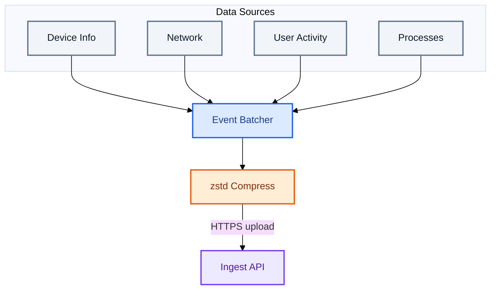
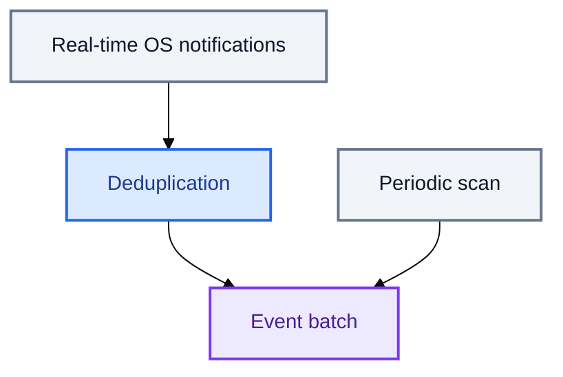

# Collection and batching

This document describes how `trustedge-agent` collects endpoint telemetry, buffers it, and uploads it to [TrustEdge-Agent-API](https://github.com/TrustEdgeOrg/TrustEdge-Agent-API). For system-wide architecture and deployment, see [Architecture](architecture.md). For environment variables, see [Configuration](configuration.md).

## Mental model

The agent watches your device in four areas, batches what it finds, and sends it to TrustEdge in one upload.

See [High-level flow](architecture.md#high-level-flow) for the full path from device to detection.



**Key properties:**

- Collectors only add events to the batch — they never talk to the network directly.
- Events from different areas (device, network, etc.) can be sent in the same batch.
- Failed uploads stay in a durable ring and are retried with backoff (auth errors still get one immediate re-register retry).

## Runtime startup

`Agent.Run()` (`internal/agent/agent.go`) wires everything together:

1. Create `EventBatcher` and start `batcher.Run(ctx)` in a goroutine.
2. Define `enqueue(typ, payload)` → `batcher.Enqueue(typ, payload)`.
3. Emit one `client_details` event immediately.
4. Start the four collector loops (details below).
5. Block until the context is cancelled (SIGINT/SIGTERM).
6. On shutdown, the batcher performs a final flush.

Registration (`EnsureRegistered`) happens before `Run()` and is independent of collection.

## Event envelope

Every enqueued payload becomes a `models.Event`:

| Field | Source |
|-------|--------|
| `event_id` | Generated timestamp ID (`evt_YYYYMMDDTHHMMSS.nnnnnnnnn`) |
| `device_id` | From credentials store (set at registration) |
| `type` | Event type constant (see table below) |
| `ts` | UTC timestamp at enqueue time |
| `payload` | Collector-specific map |

Payload field schemas are documented in the [API reference](https://github.com/TrustEdgeOrg/TrustEdge-Agent-API/blob/main/docs/api.md).

## Collectors

Four goroutines produce telemetry. All share the same `enqueue` callback.

| Collector | Event type(s) | Default interval | Config variable |
|-----------|---------------|------------------|-----------------|
| Client details | `client_details` | 60s | `TRUSTEDGE_AGENT_DETAILS_INTERVAL` |
| Network monitor | `network_summary` | 60s heartbeat + on change | `TRUSTEDGE_AGENT_NETWORK_INTERVAL`, `TRUSTEDGE_AGENT_NETWORK_DEBOUNCE` |
| Action tracker | `action_summary` | 60s | `TRUSTEDGE_AGENT_ACTION_INTERVAL` |
| Process monitor | `process_start`, `process_exit` | 10s poll + event-driven | `TRUSTEDGE_AGENT_PROCESS_INTERVAL` (`0` disables) |

### Client details

**Purpose:** Device identity and presence heartbeat for the TrustEdge twin graph.

**Trigger:**

- Once immediately when `Agent.Run()` starts.
- Then on a fixed ticker (`DetailsInterval`).

**Payload includes:** hostname, OS, OS version, arch, agent version, timezone, status (`online`), uptime since agent start.

**Implementation:** `Collector.ClientDetailsPayload()` in `internal/collect/collector.go`.

### Network summary

**Purpose:** Coarse network posture — public IP, interface type, socket counts, top remote ports.

**Trigger:**

| Reason | When |
|--------|------|
| `initial` | Once when the network monitor starts |
| `link_change` | OS signals a link change, debounced |
| `heartbeat` | Every `NetworkInterval`, always emitted |

**Debounce:** Rapid link changes are coalesced. The monitor waits `NetworkDebounce` (default 2s) after the last signal before emitting.

**Dedup:** For `initial` and `link_change`, the monitor compares a **summary fingerprint** (public IP, network type, listening/established counts, top ports). If unchanged since the last post, the event is skipped. **Heartbeats always post** so liveness continues even when posture is stable. The same payload used for fingerprinting is attached to `NetworkChange` and enqueued — the agent does not collect the summary a second time.

**Data collection** (`NetworkSummaryPayload`):

- Public IP via HTTP lookup (`TRUSTEDGE_AGENT_PUBLIC_IP_URL`; set `off` to disable).
- Network type from active interfaces.
- Listening and established socket counts via `netstat -an`.
- Top 5 remote ports by connection count.

**Implementation:** `NetworkMonitor` in `internal/collect/network_monitor.go`, platform watchers in `network_watch_*.go`.

### Action summary

**Purpose:** Short-window user activity — foreground app focus, idle/active presence, app switches.

**Trigger:** Every `ActionInterval`. Each tick:

1. `tracker.Sample()` — read foreground app and accumulate focus duration.
2. `tracker.SnapshotAndReset()` — build summary for the window, reset counters.
3. Enqueue one `action_summary` event.

**Sampling logic:**

- Foreground app is read via platform probe (`foreground_*.go`).
- Focus time is accumulated per app (by bundle ID, falling back to name).
- App switches are counted when the foreground app changes between samples.
- Presence is `active` if idle seconds &lt; 60, otherwise `idle`.

**Payload includes:** `window_start`, `window_end`, `focus[]`, `presence`, `idle_sec`, `app_switches`.

**Implementation:** `ActionTracker` in `internal/collect/actions.go`.

### Process monitor

**Purpose:** Process lifecycle visibility — new and exited processes with metadata and command line.

**Two layers run in parallel:**



#### Event-driven path

When a platform watcher is available (`NewProcessWatcher`), it streams `process_start` and `process_exit` in real time. Each change passes through `ProcessMonitor.Observe()`:

- **Start:** Skip if PID is already in the `seen` map (dedup).
- **Exit:** Always accepted; enriches missing fields from `seen`, then removes PID.

If the watcher is unavailable (permissions, CGO disabled on macOS, etc.), poll-only mode is used.

#### Poll path

Every `ProcessInterval`, `ProcessMonitor.Poll()`:

1. Lists the current process table (platform-specific).
2. On the **first poll**, seeds `seen` silently — **no events emitted**.
3. On subsequent polls, diffs against `seen`:
   - PIDs in current but not in `seen` → `process_start`
   - PIDs in `seen` but not in current → `process_exit`
4. Caps at **100 `process_start` events per poll** to avoid flooding after large state drift.

**Disable entirely:** `TRUSTEDGE_AGENT_PROCESS_INTERVAL=0`.

**Implementation:** `ProcessMonitor` in `internal/collect/process_monitor.go`, watchers in `process_watch_*.go`.

## Batching

The `EventBatcher` (`internal/agent/batcher.go`) shares a durable ring buffer (`EventRing`) across all collectors. Events are appended to the ring on enqueue and only removed after a successful upload.

### Flush triggers

Any one of these causes a flush:

| Trigger | Default | Config |
|---------|---------|--------|
| Buffer full | 32 events | `TRUSTEDGE_AGENT_EVENT_BATCH_SIZE` |
| Timer | 2 seconds | `TRUSTEDGE_AGENT_EVENT_BATCH_FLUSH` |
| Shutdown | Context cancelled | — |

### Flush behavior

1. `Peek` up to `EventBatchSize` events from the ring (do not remove them yet).
2. Call `postEvents(batch)` (see [Upload](#upload)).
3. On success, `Ack` those events (persist the shorter ring). On failure, leave them queued and increase flush backoff up to `TRUSTEDGE_AGENT_EVENT_RETRY_MAX`.
4. Log success (`posted batch (N events, pending=…)`) or failure (`post batch (N events, pending=…): <err>`).

### Offline ring

| Setting | Default | Behavior |
|---------|---------|----------|
| `TRUSTEDGE_AGENT_EVENT_QUEUE_CAPACITY` | `4096` | Bounded FIFO; overwrite oldest when full |
| `TRUSTEDGE_AGENT_EVENT_QUEUE_PATH` | `<state-dir>/events.queue.json` | Atomic JSON persistence across restarts |

### Coalescing

When the buffer hits max size, `signalFlush()` sends a non-blocking signal on a buffered channel (size 1). Multiple size-triggered signals coalesce — only one immediate flush is queued.

### Timing example

With defaults (batch size 32, flush 2s) and all collectors active:

```
t=0s    client_details enqueued (1 event in buffer)
t=0s    network_summary initial enqueued (2 events)
t=2s    timer flush → POST 2 events
t=10s   process poll may add starts/exits
t=12s   timer flush → POST accumulated events
...
t=60s   client_details + action_summary + network heartbeat → may batch together
```

High-activity endpoints (many process events) hit the size trigger more often; quiet endpoints rely on the 2s timer.

## Upload

### Serialization

`client.PostEvents()` (`internal/api/client.go`):

| Batch size | JSON shape |
|------------|------------|
| 1 event | Plain `Event` object |
| 2+ events | `{"events":[...]}` (`EventBatch`) |

### Compression

JSON is passed through `codec.MaybeCompress()` (zstd):

- Compressed only when smaller than raw JSON.
- Compressed requests set `Content-Encoding: zstd`.
- Small single-event payloads often stay uncompressed.

### HTTP request

```
POST /v1/events
Content-Type: application/json
Content-Encoding: zstd          (if compressed)
Authorization: Bearer <device_token>
```

The API responds with `202 Accepted` and `{ "status": "accepted", "accepted": N }`.

### Auth recovery

On `401 Unauthorized` (`internal/agent/auth.go`):

1. Clear stored device token.
2. Re-register via `POST /v1/register`.
3. Retry the **same batch** once.

Any other error (network timeout, 5xx, etc.) is logged and the batch stays in the durable ring for retry with exponential backoff.

## Concurrency model

```text
main goroutine
├── batcher.Run()          — flush loop (timer + wake channel + shutdown)
├── loop(DetailsInterval)  — client_details
├── NetworkMonitor.Run()   — network_summary (watcher + heartbeat)
├── loop(ActionInterval)   — action_summary
├── ProcessWatcher.Run()   — event-driven process events (if available)
└── loop(ProcessInterval)  — process poll reconciliation
```

Collectors are independent — a slow public IP lookup in network collection does not block process events from enqueueing (though it may delay that collector's next emit).

## Configuration quick reference

| Variable | Default | Affects |
|----------|---------|---------|
| `TRUSTEDGE_AGENT_DETAILS_INTERVAL` | `60` | Client details heartbeat |
| `TRUSTEDGE_AGENT_NETWORK_INTERVAL` | `60` | Network heartbeat |
| `TRUSTEDGE_AGENT_NETWORK_DEBOUNCE` | `2` | Network change debounce |
| `TRUSTEDGE_AGENT_ACTION_INTERVAL` | `60` | Action summary window |
| `TRUSTEDGE_AGENT_PROCESS_INTERVAL` | `10` | Process poll; `0` = off |
| `TRUSTEDGE_AGENT_EVENT_BATCH_SIZE` | `32` | Max events before flush |
| `TRUSTEDGE_AGENT_EVENT_BATCH_FLUSH` | `2` | Max seconds between flushes |
| `TRUSTEDGE_AGENT_EVENT_QUEUE_CAPACITY` | `4096` | Offline ring capacity |
| `TRUSTEDGE_AGENT_EVENT_RETRY_MAX` | `60` | Max upload retry backoff |
| `TRUSTEDGE_AGENT_PUBLIC_IP_URL` | ipify | Public IP lookup; `off` disables |

Full reference: [Configuration](configuration.md).

## Source code map

| Concern | Package / file |
|---------|----------------|
| Agent orchestration | `internal/agent/agent.go` |
| Batching + flush | `internal/agent/batcher.go` |
| Durable event ring | `internal/agent/ring.go` |
| Auth + upload | `internal/agent/auth.go` |
| HTTP client | `internal/api/client.go` |
| zstd compression | `internal/codec/zstd.go` |
| Event models | `internal/models/events.go` |
| Collectors | `internal/collect/` |
| Config | `internal/config/config.go` |

## Known limitations

| Behavior | Detail |
|----------|--------|
| Bounded offline ring | When capacity is exceeded, oldest pending events are overwritten |
| Process poll cap | Max 100 `process_start` events per poll cycle |
| Silent first poll | Process monitor seeds state without emitting |
| Network dedup | Change events skipped when fingerprint unchanged; heartbeats always post |

## Related docs

- [Architecture](architecture.md) — end-to-end system diagram, API persistence, project layout
- [Agent](agent.md) — installation, platform requirements, privacy boundaries
- [Configuration](configuration.md) — all environment variables
- [API reference](https://github.com/TrustEdgeOrg/TrustEdge-Agent-API/blob/main/docs/api.md) — payload field details
