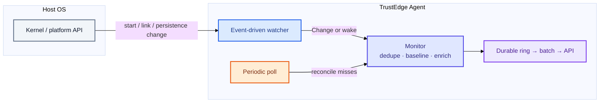
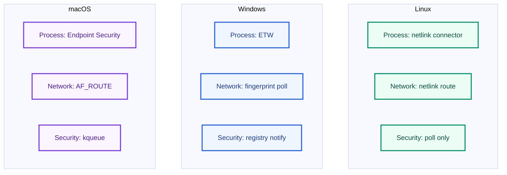

#  Platform watchers

How `trustedge-agent` gets low-latency change signals on Linux, Windows, and macOS — without sacrificing correctness when the OS API is unavailable.

> **Design in one sentence:** Watchers for latency, polls for correctness; if a watcher dies we degrade, we don’t fail.

<p align="center">
  
  &nbsp;<a href="#shared-model">Model</a>
  &nbsp;·&nbsp;
  
  &nbsp;<a href="#platform-matrix">Matrix</a>
  &nbsp;·&nbsp;
  
  &nbsp;<a href="#how-each-domain-uses-the-signal">Domains</a>
  &nbsp;·&nbsp;
  
  &nbsp;<a href="#talking-points-60-seconds">Talking points</a>
</p>

> **Also see**
>  [Collection](collection.md) — visual per-OS detection diagrams
> ·  [Agent guide](agent.md#platforms)
> ·  [Docs hub](README.md)

---

##  Shared model

Every monitored domain follows the same hybrid loop:



| Path | Role |
|------|------|
| **Watcher** | Near-real-time signal when the platform exposes one |
| **Poll** | Source of truth — silent baseline, catch misses, works alone if watcher is `nil` |
| **Monitor** | Dedup, enrich, and decide what to enqueue |

---

##  Platform matrix

| Domain | Linux | Windows | macOS |
|--------|-------|---------|-------|
| **Process** | Netlink connector (`PROC_EVENT_EXEC` / `EXIT`) | ETW kernel-process provider | Endpoint Security (`NOTIFY_EXEC` / `EXIT`, CGO) |
| **Network** | Netlink route (`NEW/DEL LINK` · `ADDR`) | Interface fingerprint poll (~2s) | AF_ROUTE socket |
| **Security** | Poll only | `RegNotifyChangeKeyValue` on Run/RunOnce + Services | `kqueue` `EVFILT_VNODE` on LaunchAgents / LaunchDaemons |

Unavailable watcher (permissions, CGO off, missing entitlement) → **poll-only**; collection keeps running.



---

##  How each domain uses the signal

### Process — emit typed events

```text
OS notify  →  ProcessWatcher  →  Change{process_start|process_exit}
                                      ↓
                               ProcessMonitor.Observe()  →  enqueue
Periodic ProcessInterval poll  →  ProcessMonitor.Poll()  →  enqueue (misses)
```

- Watcher carries PID / image / cmdline when the OS provides them.
- Poll diffs the process table; first poll seeds `seen` **silently**.

### Network — wake, then snapshot

```text
OS link/addr change  →  platform watcher  →  link_change signal
                                              ↓
                                    debounce → summary fingerprint → enqueue
Heartbeat every NetworkInterval  →  always enqueue (liveness)
```

Windows has no socket watcher here — the same `link_change` path is driven by a short fingerprint poll.

### Security — wake only, poll decides

```text
Registry / plist change  →  SecurityWatcher  →  wake (debounced ~250ms)
                                                    ↓
                                         SecurityMonitor.Poll()  →  enqueue diffs
Periodic SecurityInterval poll   →  same Poll() path
```

The watcher never invents `driver_load` / `service_install` / `registry_persistence` — it only asks Poll to re-scan.

---

##  Talking points (60 seconds)

1. **Hybrid by design** — event path for speed, poll path for correctness and cold start.  
2. **Degrade, don’t fail** — watcher setup errors log and continue; intervals still fire.  
3. **Platform-native APIs** — netlink / ETW / Endpoint Security / kqueue / registry notify.  
4. **One enqueue path** — all collectors feed the durable ring; upload and auth recovery stay shared.

---

##  Related docs

| | Doc | Purpose |
|---|-----|---------|
|  | [Collection & batching](collection.md) | Collector payloads, flush rules, concurrency |
|  | [Agent guide](agent.md) | CGO builds, entitlements, credentials |
|  | [Architecture](architecture.md) | Lifecycle and upload path |
|  | [Docs hub](README.md) | Interview start path |
